### PhpStorm配合Xdebug进行Web Application进行断点调试 

1. 首先需要安装php-xdebug扩展

   - mac环境下建议使用brew命令进行便捷安装

     ```shell
     brew install phpXX-xdebug
     ```

     *注：‘XX’ 为当前php运行环境版本 如* `brew install php70-xdebug`  

   - windows环境下须下载运行环境版本对应的扩展dll文件进行加载

     下载地址 `http://pecl.php.net/package/xdebug`

   - Linux环境下需要进行编译安装

     下载地址 `http://pecl.php.net/package/xdebug`

     *在编译过程中可能需要其他依赖，须先安装依赖再进行编译*

2. 扩展安装完成后，需要在`php.ini`添加以下内容

   ```ini
   [xdebug]
   xdebug.profiler_append = 0
   xdebug.profiler_enable = 1
   xdebug.profiler_enable_trigger = 0
   xdebug.profiler_output_dir ="/var/tmp/php/xdebug"
   xdebug.trace_output_dir ="/var/tmp/php/xdebug"
   xdebug.profiler_output_name = "cache.out.%t-%s"
   xdebug.remote_enable = 1
   xdebug.remote_mode = "req"
   xdebug.remote_handler = "dbgp"
   xdebug.remote_host = "127.0.0.1"
   xdebug.remote_port = 9001
   xdebug.idekey="PHPSTORM"
   xdebug.remote_autostart = no

   #zend_extension="/{extension_dir}/xdebug.so"
   #zend_extension="/{extension_dir}/xdebug.dll"
   ```

   添加完成后重启服务，打印`phpinfo()` ，确认xdebug模块已加载。结果如下图:

   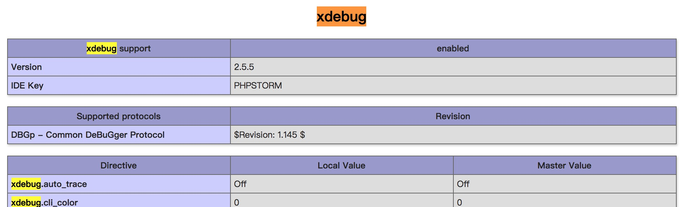

3. 配置phpStorm

   - 首先打开PhpStorm设置，配置php版本

     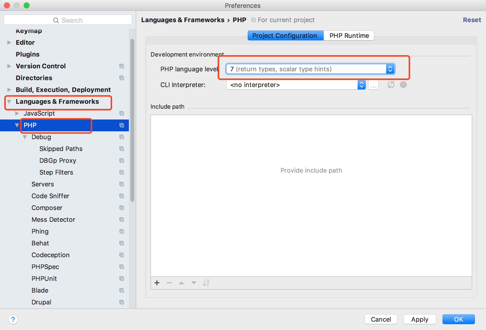

   - 然后，配置debug监听端口为9001（与配置中的xdebug.remote_port相同）

     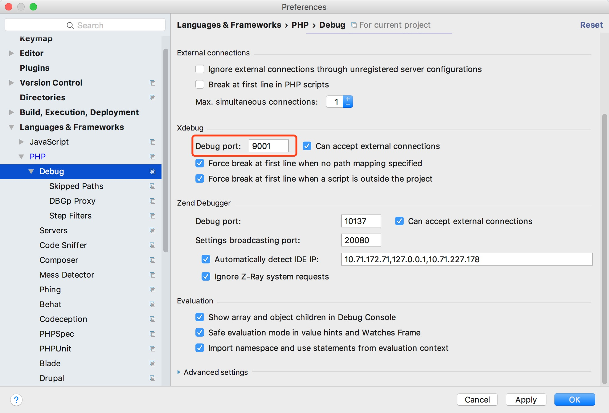

   - 增加一个phpServer，配置server的名称，本地测试域名以及端口

     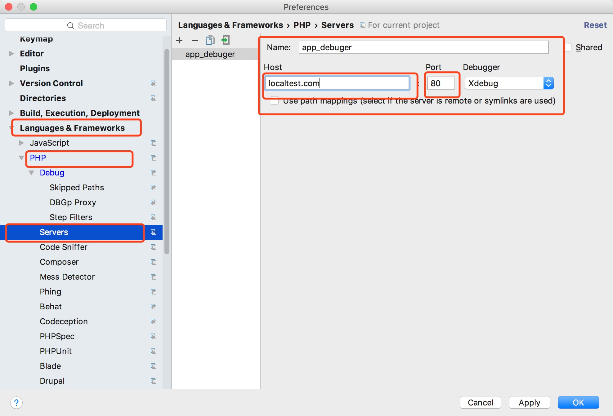

   - 配置debug代理

     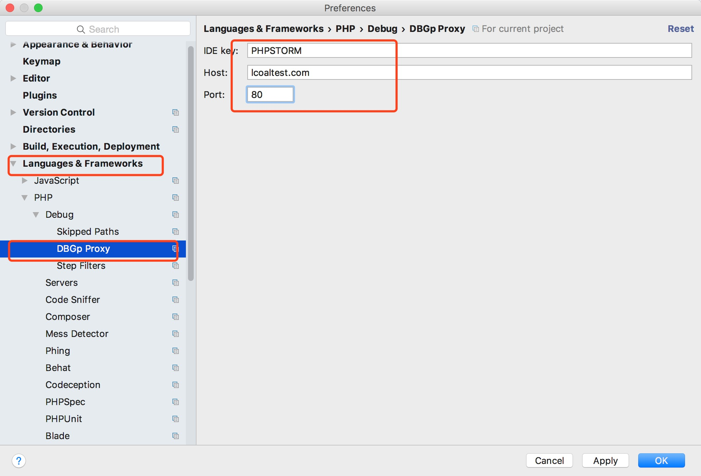

   - 在菜单栏中点击Run->Edit Configurations...增加一个debug配置 如下图

     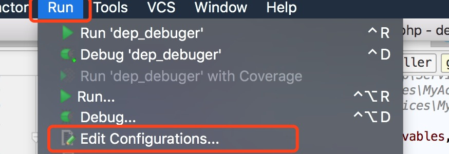

     点击‘+’号 并选择添加一个PHP Web Application ，配置名称及所使用的server(即我们刚才添加的server)

     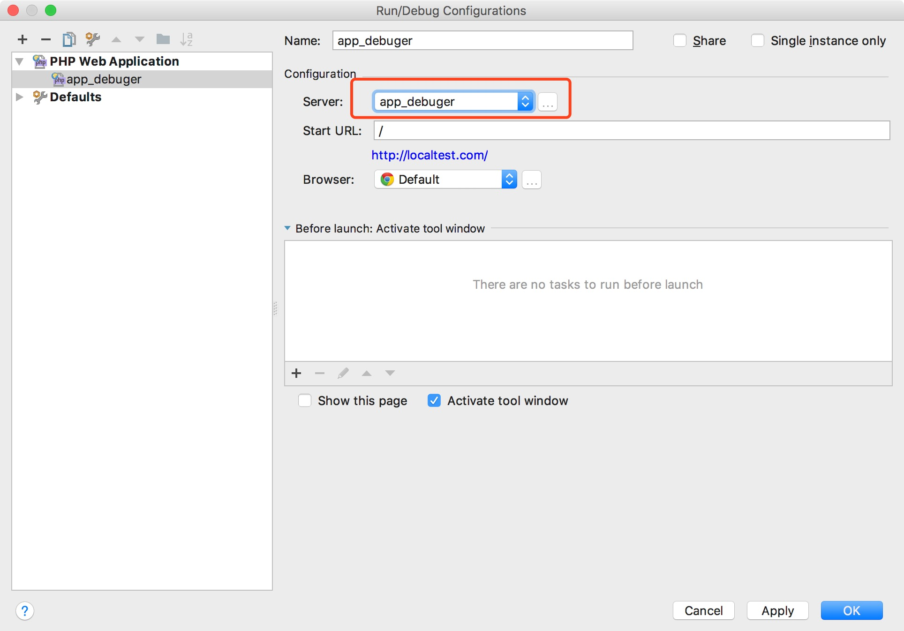

   - 在浏览器中安装Xdebug-Helper（推荐google和火狐浏览器 google安装扩展需要翻墙）

     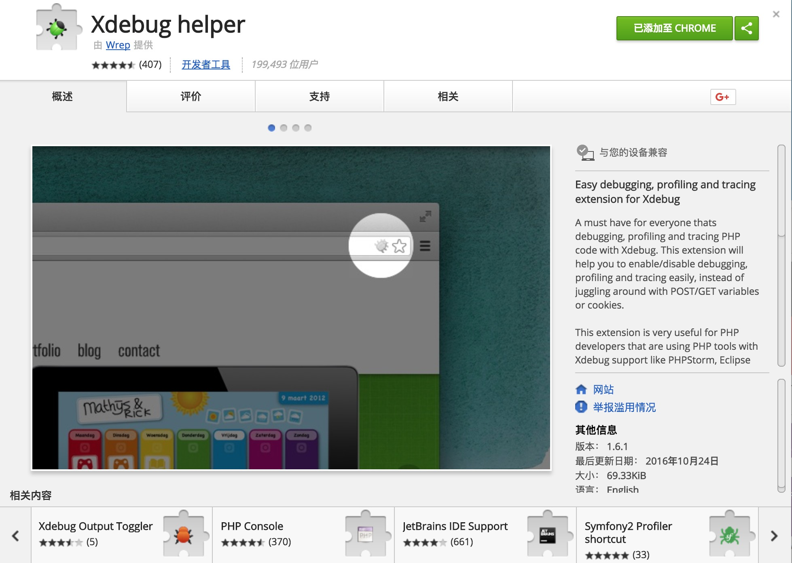

   - 右键点击扩展图标，打开选项配置，配置ide选项

     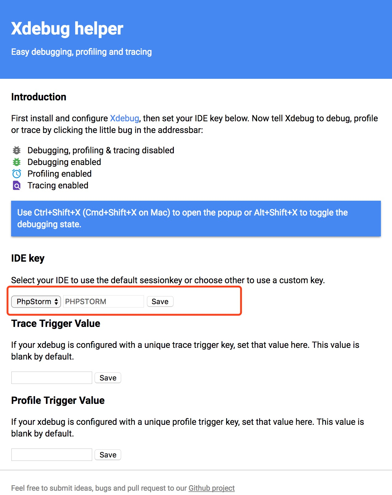

   - 在phpStorm中开启debug listening监听 

     

     或点击Run->Start Listening for PHP Debug Connections

     同时在浏览器中激活扩展 

     

4. 在php项目中增加断点，并通过浏览器访问打点路由，然后返回phpStorm界面即可进行断点调试

   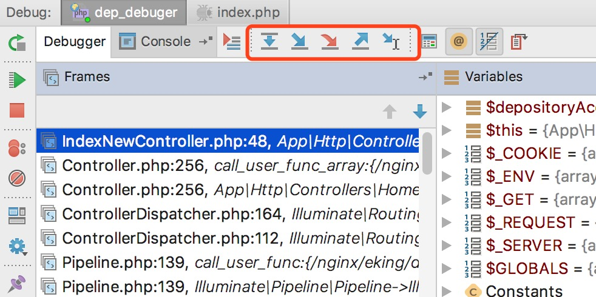

   **注：在phpStorm中开启Debug也可进行断点调试，**

   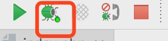

   ​